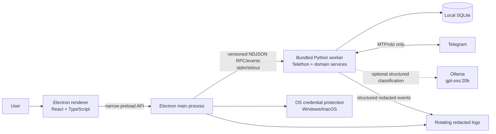
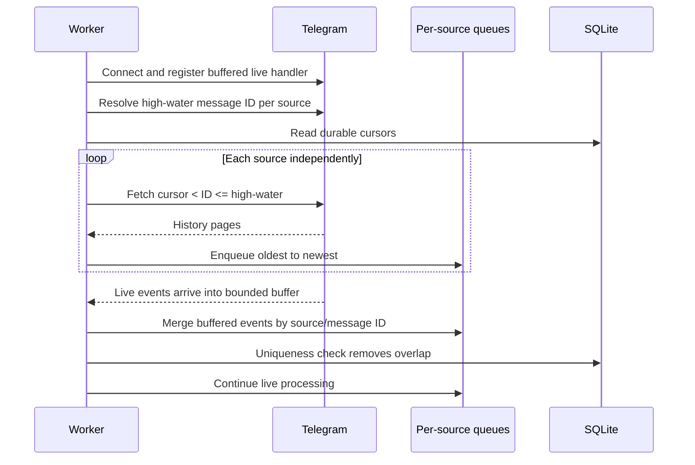
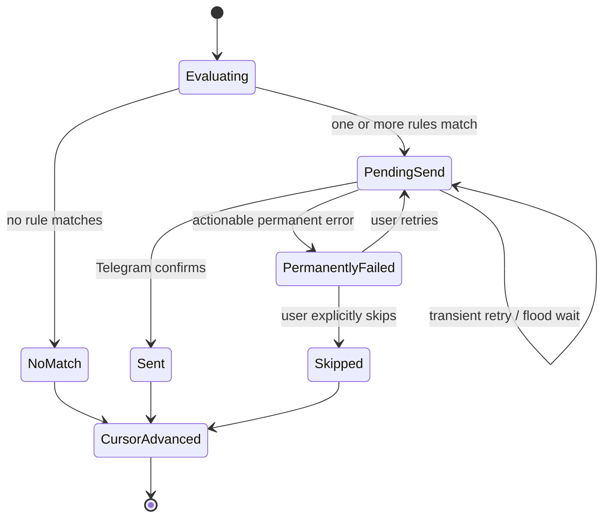

# System design

Status: proposed architecture for MVP  
Companion document: [App description and MVP scope](APP_DESCRIPTION.md)

## 1. Architecture decision

Use a **hybrid local desktop architecture**:

- Electron provides the cross-platform application shell, renderer security,
  onboarding, configuration, dashboard, OS credential encryption, and packaging.
- A bundled Python worker owns Telegram connectivity through Telethon, rule
  execution, message processing, and SQLite persistence.
- Electron and the worker communicate through a versioned request/event protocol
  over the child process's standard streams. No localhost web server or open port
  is used.

This keeps one Windows/macOS UI codebase while retaining Telethon's mature
personal-account MTProto support. The main cost is packaging two runtimes and
maintaining an explicit IPC contract. The design accepts that cost and isolates
it behind a narrow boundary.

### Alternatives considered

| Alternative | Decision |
| --- | --- |
| Electron with a Node Telegram library | Not selected for the baseline. It simplifies packaging but gives up the requested, established Telethon path and would require revalidating recovery/session behavior. |
| Python-only desktop UI | Not selected. It simplifies the process model but provides a less predictable modern cross-platform UI and packaging path for this product. |
| Tauri plus Python sidecar | Viable later, but adds Rust and a third toolchain without a demonstrated MVP need. |
| Local web app/backend | Rejected because the user wants a desktop app and the product must not introduce a custom backend. |

An early technical spike must prove authentication, raw idempotent sending, and
packaging before broad UI work. If Telethon cannot expose the required raw MTProto
behavior cleanly, the architecture decision is revisited before features build
on it.

## 2. Context and process view



### Trust boundaries

- The renderer is untrusted relative to OS and Telegram credentials. It has
  `contextIsolation` enabled, Node integration disabled, sandboxing enabled, and
  access only to allow-listed preload methods.
- Electron main owns app lifecycle, worker lifecycle, file paths, and OS
  credential encryption/decryption.
- The Python worker is trusted local application code. It receives credentials
  only for the active session and never prints them.
- SQLite stores operational metadata but no source message body/caption.
- When an applicable AI rule is enabled, the worker sends message text and that
  rule's classification and action prompts to the configured Ollama endpoint.
  The default loopback endpoint keeps that traffic on the local computer; users
  are warned before configuring a remote endpoint.
- Standard output is reserved for protocol frames. Human-readable logs go to
  standard error or a controlled log sink and pass through redaction.

## 3. Recommended project shape

This is a future implementation layout, not scaffolding that currently exists:

```text
apps/
  desktop/            Electron main, preload, renderer
services/
  telegram-worker/    Python entry point and application services
packages/
  ipc-contract/       JSON schemas and generated TypeScript/Python models
  ui/                 Optional shared UI components
tests/
  fixtures/           Synthetic messages and Telegram gateway responses
docs/
```

The project should use TypeScript throughout Electron, Python type hints in the
worker, and one root command surface for build, lint, and test tasks.

## 4. Component responsibilities

### Electron renderer

- Onboarding and authentication prompts.
- Source, destination, rule, and settings screens.
- Dashboard status and redacted activity.
- Form validation and accessible interactions.
- No direct file, database, process, or network access.

### Preload bridge

- Exposes a small typed API such as `auth.start`, `auth.submitCode`,
  `chats.list`, `configuration.update`, `monitor.start`, and `status.subscribe`.
- Validates renderer arguments against shared schemas.
- Does not expose generic IPC send/invoke primitives.

### Electron main

- Enforces single-instance behavior.
- Resolves platform-specific application data and log paths.
- Encrypts/decrypts authorization material and API hash with Electron's OS
  credential protection API.
- Starts, health-checks, and gracefully stops the Python worker.
- Performs the IPC version handshake and rejects incompatible workers.
- Restarts an unexpectedly exited worker with rate limits and surfaces a crash
  loop instead of restarting indefinitely.
- Controls windows, native menus, and destructive confirmation dialogs.

### Python worker

Internally separated into:

- `telegram_gateway`: Telethon client, login flow, dialogs, history, live events,
  sends/forwards, error translation, and flood-wait handling.
- `configuration_service`: validates destinations, sources, scan modes, and
  rules.
- `matcher`: pure normalization and rule evaluation.
- `formatter`: builds escaped formatted-copy output and source links.
- `processor`: owns per-source queues and the message state machine.
- `recovery_service`: initial scans, high-water marks, buffered live hand-off,
  pending-send recovery, and retries.
- `repositories`: transactions, migrations, cursors, processing outcomes, and
  settings.
- `status_service`: derives health/status events without content.

The Telegram gateway is an interface so tests use a deterministic fake instead
of a real Telegram account.

## 5. IPC protocol

Use newline-delimited JSON over standard input/output. Every frame has:

```json
{
  "protocolVersion": 1,
  "type": "request",
  "id": "01J...",
  "method": "chats.list",
  "payload": {}
}
```

Response and event frames use the same protocol version and typed payload
schemas. Requirements:

- handshake before any business request;
- request correlation IDs and timeouts;
- explicit error codes safe to display;
- cancellation for long chat loads and scans;
- bounded event queues/coalescing for high-frequency progress;
- no credential, login code, password, session string, message body, or caption
  in protocol logs;
- maximum frame size and strict schema validation on both sides; and
- contract tests that load the same golden request/response fixtures in
  TypeScript and Python.

Authentication fields necessarily cross the local in-memory IPC channel for the
active request, but are marked sensitive and excluded from diagnostics.

## 6. Local data model

Use SQLite in WAL mode, enable foreign keys, set a busy timeout, and let the
Python worker be the only database writer. All schema changes use numbered,
transactional migrations.

### `app_settings`

| Column | Notes |
| --- | --- |
| `key` | Primary key |
| `value_json` | Non-secret validated JSON value |
| `updated_at` | UTC timestamp |

Contains destination peer ID, delivery mode, pause state, and application
options. This database-backed model replaces the brief's optional YAML-first
configuration because the MVP is a desktop GUI; YAML/JSON import/export can be
added later. Credentials and Telegram authorization material are not stored
here.

### `telegram_peers`

| Column | Notes |
| --- | --- |
| `peer_id` | Stable Telegram peer ID, primary key |
| `peer_type` | user, basic group, supergroup, or channel |
| `access_hash` | Sensitive peer access data if required by the client |
| `display_name` | Cached UI label |
| `username` | Nullable |
| `can_write` | Last-known capability |
| `refreshed_at` | UTC timestamp |

Peer cache data is replaceable and is refreshed after sign-in and on demand.

### `monitored_sources`

| Column | Notes |
| --- | --- |
| `peer_id` | Primary/foreign key |
| `enabled` | Boolean |
| `initial_scan_mode` | `now`, `latest_count`, or `recent_window` |
| `initial_scan_value` | Nullable bounded integer |
| `created_at`, `updated_at` | UTC timestamps |

### `rules`

| Column | Notes |
| --- | --- |
| `id` | UUID primary key |
| `source_peer_id` | Nullable means global; otherwise foreign key |
| `type` | keyword, phrase, or hashtag |
| `pattern` | Validated literal |
| `case_sensitive` | Default false |
| `whole_word` | Supported for keyword; constrained for other types |
| `enabled` | Boolean |
| `created_at`, `updated_at` | UTC timestamps |

### `source_cursors`

| Column | Notes |
| --- | --- |
| `source_peer_id` | Primary/foreign key |
| `last_terminal_message_id` | Highest contiguously handled source message |
| `initialized_at` | UTC timestamp |
| `updated_at` | UTC timestamp |

There is one serial processing queue per source, so a cursor never skips an
unresolved earlier message.

### `message_processing`

| Column | Notes |
| --- | --- |
| `source_peer_id` | Part 1 of primary key |
| `source_message_id` | Part 2 of primary key |
| `source_timestamp` | UTC timestamp |
| `outcome` | pending, no_match, sent, permanently_failed, or skipped |
| `matched_rule_ids_json` | IDs only; empty for no-match |
| `delivery_random_id` | Nullable signed 64-bit Telegram idempotency ID |
| `destination_peer_id` | Nullable until matched |
| `destination_message_id` | Nullable until confirmed |
| `attempt_count` | Retry diagnostics |
| `error_code` | Nullable redacted category |
| `created_at`, `updated_at` | UTC timestamps |

The composite primary key is the local deduplication constraint. No source body,
caption, author name, or formatted destination content is retained.

### `schema_migrations`

Records the ordered migration version and application timestamp. Startup stops
with an actionable error if a migration cannot complete.

## 7. Matching pipeline

The matcher is deterministic and side-effect free:

1. Select `message.text` or the media caption. If neither exists, return no
   match.
2. Normalize message and patterns to Unicode NFC.
3. For case-insensitive rules, compare Unicode case-folded values.
4. Evaluate enabled global rules plus enabled rules for the source.
5. Implement keyword whole-word semantics with Unicode-aware alphanumeric and
   underscore boundaries; do not rely blindly on ASCII regex `\b`.
6. Implement hashtag boundaries explicitly so `#action` does not match
   `#actionable`.
7. Evaluate enabled AI rules in configuration order alongside literal rules;
   rules configured for forwarded messages apply only when Telegram marks the
   incoming source message as forwarded.
8. For every matching AI rule, run its action prompt and append the results to a
   formatted copy or send them immediately after an unmodified native forward.
9. Return the matched rule IDs in stable configuration order.

The pure matcher is the most heavily unit-tested domain module. Synthetic
fixtures cover ASCII, non-Latin scripts, composed/decomposed Unicode, emoji next
to tags, punctuation, multiline captions, and adversarial long text.

## 8. Startup, catch-up, and live hand-off

The worker uses one canonical enqueue path for history and live events:



Registering a buffer before the history scan closes the race in which a message
could arrive after the high-water lookup but before a listener was active.
History remains the first data processed; live events are drained only after
that source reaches its high-water mark.

### Initial scan modes

- **Now:** resolve the current high-water ID and initialize the cursor to it. No
  existing messages are processed.
- **Latest N:** fetch at most the bounded N messages present at confirmation and
  enqueue oldest-to-newest.
- **Recent window:** fetch messages at or after the calculated UTC cutoff up to
  the confirmation high-water and enqueue oldest-to-newest.

The chosen boundary is persisted when setup is confirmed, making a restart
during the first scan deterministic.

### Live/catch-up overlap

Both sources may contain the same message. The composite processing key plus the
serial source queue makes enqueueing idempotent. Telegram edits are ignored in
the MVP and do not create new processing attempts.

## 9. Per-message state machine and idempotency



For a matching message:

1. Derive a stable, non-zero signed 64-bit `delivery_random_id` from a
   domain-separated hash of account ID, destination peer ID, source peer ID, and
   source message ID.
2. Commit a `pending` row with that ID before contacting Telegram.
3. Send a formatted message or native forward using the low-level Telegram
   request and the persisted ID.
4. On confirmation, transactionally mark it `sent`, record the destination
   message ID, and advance the source cursor.
5. If the process crashes after Telegram accepts the send but before step 4,
   retry with the same ID. Telegram uses `random_id` to deduplicate resend
   attempts and associates it with the resulting outgoing message.

Telegram documents `random_id` as the mechanism that prevents repeated sends,
including recovery when a response is lost:
[Working with Updates](https://core.telegram.org/api/updates). Both
[`messages.sendMessage`](https://core.telegram.org/method/messages.sendMessage)
and
[`messages.forwardMessages`](https://core.telegram.org/method/messages.forwardMessages)
support it.

The implementation spike must test Telethon's raw request path and handling of a
duplicate/in-flight response. High-level send helpers must not silently generate
a new random ID on retry.

For no-match, write the terminal outcome and cursor advancement in one database
transaction. A permanent failure blocks only that source until retry or an
explicit persisted skip; other sources continue.

## 10. Formatting

The formatter consumes an in-memory normalized message DTO and returns Telegram
text plus entities/markup. It:

- escapes all user-controlled fields;
- does not treat source text as markup;
- preserves the source timestamp and converts only for presentation;
- has deterministic matched-rule ordering;
- creates public `t.me/<username>/<id>` or eligible private `t.me/c/...` links
  only when valid;
- labels unavailable author/link data without failing delivery; and
- enforces Telegram length limits before the gateway call.

Formatting and truncation are pure functions with snapshot/golden unit tests.

## 11. Authentication and secret storage

Telethon session authorization is effectively account access. Telethon's own
documentation warns that anyone with session authorization material can use the
account, so it must be treated as a secret:
[Telethon session documentation](https://docs.telethon.dev/en/stable/concepts/sessions.html).

MVP design:

1. Electron main encrypts the API hash and serialized Telegram authorization
   material with the platform credential protection facility.
2. The encrypted blob is stored beneath the app's user-data directory with
   user-only permissions where the platform supports them.
3. Main decrypts it only while starting an authenticated worker and transfers it
   through the private child-process channel.
4. The worker keeps it in memory, redacts exceptions, and returns updated
   serialized authorization state through a sensitive response path.
5. Logout first asks Telegram to log out when reachable, then clears in-memory
   material and removes the encrypted local blob. "Delete all local data" also
   removes SQLite state and logs after confirmation.

The final Telethon major version and serialization adapter must be pinned after
the spike; the architecture must not assume a deprecated session class.

## 12. Failure policy

| Failure | Behavior |
| --- | --- |
| Network offline/transient RPC | Mark offline/retrying, exponential backoff with jitter, keep cursors unchanged |
| Telegram flood wait | Persist next-attempt time, wait the exact required interval, continue automatically |
| Invalid/revoked session | Stop Telegram operations, show sign-in required, preserve non-secret configuration |
| Source inaccessible | Mark only that source action-required; keep other source queues running |
| Destination not writable | Pause sends for all sources, retain pending work, prompt for a new destination or retry |
| Native forwarding prohibited | Mark that source message permanently failed; allow explicit skip or mode change and retry |
| Database busy | Retry briefly; unexpected persistent lock becomes action-required |
| Migration failure/corruption | Stop before processing and offer redacted diagnostics; never recreate/overwrite automatically |
| Worker crash | Main performs bounded restart; worker resumes from persisted pending rows/cursors |
| Disk full | Stop cursor advancement, surface a clear error, resume only after a successful durable write |

Retries use a persisted schedule so an app restart does not create a tight retry
loop. No automatic fallback changes delivery semantics.

## 13. Concurrency and lifecycle

- One asyncio task/queue per source preserves source order.
- A global bounded semaphore limits concurrent Telegram calls.
- SQLite writes are short transactions on one worker-owned connection manager.
- UI requests never mutate Telegram state directly; commands go through
  application services.
- Pause stops dequeueing new messages after the current atomic operation and
  preserves buffered/catch-up work.
- Graceful exit stops intake, allows a short in-flight completion window,
  checkpoints SQLite, disconnects Telegram, then terminates the worker.
- Forced exit remains safe because pending rows and cursors are durable.

## 14. Test strategy and quality gates

Unit tests are mandatory and are delivered with the behavior they test—not as a
cleanup phase.

### Required unit suites

Python tests (for example, `pytest`):

- normalization and every rule type/option;
- multi-rule one-delivery decision;
- formatter escaping, links, ordering, timestamps, and length limits;
- scan-boundary and oldest-first planning;
- cursor state machine and pending-send recovery;
- deterministic idempotency-ID derivation;
- error classification, backoff, and flood waits;
- configuration and migration validation; and
- log redaction.

TypeScript tests (for example, `Vitest`):

- renderer state reducers/view models;
- onboarding validation;
- preload allow-list and IPC argument validation;
- main-process worker lifecycle state machine;
- credential redaction/serialization boundaries; and
- user-visible error mapping.

### Required integration/contract suites

- TypeScript/Python IPC golden fixtures and protocol-version mismatch.
- SQLite repository tests against temporary real databases, including migration
  upgrades and uniqueness constraints.
- Processor tests using a fake Telegram gateway for crash points, retries,
  overlap, per-source isolation, and ordering.
- Packaged worker startup/handshake smoke test on Windows and macOS CI runners.

These tests do not require live Telegram credentials and do not contact
Telegram.

### Quality gates

- Every acceptance criterion has an automated unit or integration test unless
  explicitly marked manual.
- All tests pass on supported Windows and macOS runners.
- Core domain modules (matcher, processor state machine, cursor logic,
  idempotency, and formatter) target at least 90% branch coverage.
- Changed code cannot reduce the agreed coverage threshold.
- Lint, type checking, migration checks, and secret scanning pass.
- No skipped/quarantined required test at release without a documented blocking
  issue and owner.

### E2E position

Playwright-driven Electron E2E is a planned later phase. The first E2E slice
should use a fake worker to automate onboarding, configuration, monitoring
status, and recovery UI. A real Telegram account must not be used in ordinary
CI. Until E2E is established, a versioned manual packaged-build checklist is a
release requirement.

## 15. Packaging and release

- Build the Python worker as a platform/architecture-specific sidecar with
  pinned dependencies.
- Package the matching sidecar inside the Electron artifact and verify its
  checksum before launch.
- Produce Windows x64 and macOS Apple-silicon/Intel artifacts unless the support
  matrix is narrowed.
- Establish reproducible dependency locks and software bill-of-materials
  generation.
- Code signing/notarization is required for a broadly distributed build. An
  internal evaluation build may be unsigned only if stakeholders accept OS
  warnings and receive documented installation steps.
- The MVP has no auto-updater or network destination other than Telegram.

## 16. Observability without content leakage

Structured event fields may include:

- timestamp, severity, component, event code, app/worker version;
- hashed installation-scoped peer reference;
- source message ID only when diagnostics mode is explicitly enabled;
- rule ID, outcome, duration, attempt number, and Telegram error category.

Never include message/caption text, formatted output, display names, usernames,
phone numbers, API credentials, authorization material, login codes, passwords,
or raw IPC frames. Logs rotate by size/count, and diagnostics export shows the
exact included files before saving.

## 17. Open decisions before implementation

1. Final product name and bundle/application identifiers.
2. Minimum supported Windows and macOS versions.
3. Whether both macOS architectures are mandatory for the first evaluator
   build.
4. Internal-only versus public distribution, which determines signing and the
   Telegram API credential approach.
5. Retention policy for terminal `message_processing` rows (keep indefinitely
   for MVP is safest for deduplication).
6. Exact UI framework/component library and packaging tool.
7. Supported maximum values for latest-N and recent-window scans.

None of these prevents the first technical spikes or domain unit-test work, but
they must be settled before packaging/release cards leave the backlog.
